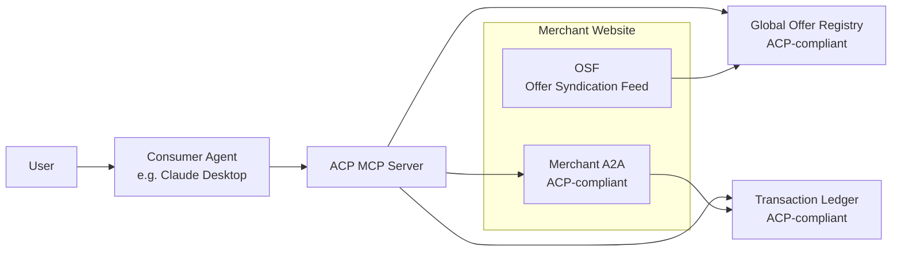

# Agentic Commerce Protocol (ACP)

> **Open protocol for AI agents to discover and transact with merchant offers**

[](https://opensource.org/licenses/MIT)
[](https://www.python.org/downloads/)
[](https://docker.com)

## 🚀 What is ACP?

The **Agentic Commerce Protocol (ACP)** is an open standard that enables AI agents to discover, validate, and transact with merchant offers in real-time. 

The ACP SDK provides a toolkit for merchants to advertise to AI agents and host their own AI agent that can reliably convert customer intent into real purchases.

The ACP MCP server allows shoppers to make purchases with natural language and earn rewards.

### Key Benefits

- **🔍 Universal Discovery**: AI agents can find offers from any ACP-compliant merchant
- **💰 Automated Bounties**: Merchants compete for agent-driven transactions with automatic bounty distribution
- **🤖 Agent-Friendly**: Standardized commerce skills that work with any AI agent framework
- **🔒 Privacy-First**: Encrypted transactions with zero-knowledge proofs for verifiable auditability
- **⚡ Real-Time**: Live offer validation, attribution, and settlement processing

## 🎯 Use Cases

- **AI Shopping Agents**: ChatGPT, Claude, and other AI assistants can discover and validate merchant offers
- **Browser Extensions**: Smart shopping tools that surface relevant offers as users browse
- **E-commerce Platforms**: Standardized integration for any merchant to participate in agent-driven commerce
- **Restaurant Ordering**: AI agents can order food, apply offers, and track delivery status
- **Retail Discovery**: Semantic search across merchant catalogs with location-based relevance

## 🏗️ Architecture Overview

The ACP SDK provides standardized tooling and protocols for all aspects of the agentic commerce ecosystem. That ecosystem is composed of the following applications:

1. **Merchant websites** - publish OSF and ACP-compliant A2A agent card
2. **Global Offer Registry (GOR)** - service providers index ACP-compliant offers  
3. **Transaction ledgers** - service providers handle attribution and settlement of offers
4. **Consumer agents** - use ACP MCP to conduct commerce with natural language

### How It Works


### ACP SDK Components

The ACP SDK provides the following standardized components:

1. **OSF & Offer Management**: Tools for publishing and managing offer syndication feeds
2. **A2A Agent Framework**: Standardized commerce skills that merchants implement for agent interactions
3. **Transaction Processing**: Privacy-aware settlement with encrypted wallets and automatic bounty distribution
4. **MCP Integration**: 11 Model Context Protocol tools for AI agent integration (discovery, search, validation, ordering, payment)
5. **Discovery & Search**: Vector-based offer discovery with semantic search and OSF ingestion


## 🚀 Quick Start

### For Merchants
ACP allows your customers to buy your products online with natural language. Follow the steps below to create an ACP-compliant web site.

#### 1. Publish an Offer Syndication Feed (OSF) on Your Site

Add this to your website's `.well-known/osf.json`:

```json
{
  "osf_version": "0.1",
  "publisher": {
    "merchant_id": "your_merchant_id",
    "name": "Your Business Name",
    "domain": "yourdomain.com"
  },
  "offers": [
    {
      "href": "https://yourdomain.com/.well-known/offers/ofr_001.json",
      "offer_id": "ofr_001",
      "updated_at": "2025-01-15T00:00:00Z"
    }
  ]
}
```

Create individual [offer documents](#-protocol-schema) at e.g. `.well-known/offers/ofr_001.json`.

#### 2. Host an ACP Agent on Your Site
Use the ACP SDK to create an ACP agent that's ready to help your customers buy products with natural language. ACP SDK makes it easy to host an A2A server on your website with standardized commerce skills that can be customized with your business logic.

```python
from acp_sdk import (
    create_acp_server,
    ACPBaseExecutor,
    OrderManagementSkill,
    PaymentProcessingSkill,
    AgentCapability
)

class MyRestaurantSkill(OrderManagementSkill):
    """Custom restaurant order management skill."""
    
    async def _handle_order_task(self, task):
        # Your custom order logic here
        return await super()._handle_order_task(task)

class MyRestaurantExecutor(ACPBaseExecutor):
    """Custom restaurant executor with business logic."""
    
    def _create_custom_skills(self):
        """Create custom skills for this restaurant."""
        return [
            MyRestaurantSkill(self.config),
            PaymentProcessingSkill()
        ]

# Create and run your restaurant agent
server = create_acp_server(
    agent_id="my_restaurant",
    name="My Restaurant",
    description="A restaurant with ordering capabilities",
    capabilities=[
        AgentCapability.PRESENT_OFFER,
        AgentCapability.INITIATE_CHECKOUT,
        AgentCapability.PROCESS_PAYMENT,
        AgentCapability.GET_MENU,
    ],
    executor_class=MyRestaurantExecutor,
    host="localhost",
    port=4001
)

server.run()
```

The A2A agent card should be exposed at `https://{yourdomain.com}/.well-known/agent-card.json`.

### For Consumers

The ACP MCP server allows you to buy products online with natural language. Just connect the ACP MCP server to your favorite MCP-compatible chat client (Claude, Cursor, etc.) and start shopping.

Here are some example natural language queries and the tools that would be called:

**"I want to order pizza for delivery"**
```python
# 1. Discover pizza restaurants
discover_merchants(query="pizza", cuisine_type="italian")

# 2. Search for delivery offers
offers_search(query="delivery pizza", lat=42.3601, lng=-71.0589)

# 3. Get menu 
get_menu(merchant_id="otto_portland")

# 4. Place order
order_food(
    merchant_id="otto_portland",
    items=[{"sku": "pizza_margherita", "qty": 1}],
    pickup=False
)
```

**"Show me nearby restaurant offers"**
```python
# Find offers near current location
offers_nearby(lat=42.3601, lng=-71.0589, radius_m=16000, limit=10)
```

**"Apply the dinner special to my order"**
```python
# Validate and apply offer
validate_offer(
    merchant_id="otto_portland", 
    offer_id="ofr_002", 
    items=[{"sku": "pizza_margherita", "qty": 1}]
)
```

## 📋 Protocol Schema

### Offer Document (v0)

```json
{
  "offer_id": "ofr_123",
  "merchant": {
    "id": "merchant_001",
    "name": "Business Name",
    "domain": "business.com",
    "location": {
      "lat": 42.3601,
      "lng": -71.0589,
      "city": "Boston",
      "country": "US"
    }
  },
  "terms": {
    "trigger": "checkout_complete",
    "bounty": {
      "currency": "USD",
      "amount": 5.00,
      "rev_share_split": {
        "user": 0.5,
        "agent": 0.4,
        "associate": 0.1
      }
    },
    "eligibility": ["US"],
    "sku_scope": ["*"],
    "expiration": "2026-12-31T23:59:59Z"
  },
  "attribution": {
    "method": "server_postback",
    "postback_url": "https://tx.example.com/postbacks",
    "required_fields": ["order_id", "agent_id", "signature", "timestamp"]
  },
  "labels": ["pizza", "delivery", "lunch"],
  "geo": { "radius_m": 16000 }
}
```

### Attribution Receipt

```json
{
  "receipt_id": "rcpt_456",
  "offer_id": "ofr_123",
  "order_id": "ord_90210",
  "agent_id": "agt_consumer",
  "user_id": "usr_123",
  "timestamp": "2025-01-15T01:15:00Z",
  "bounty_reserved": {
    "currency": "USD",
    "amount": 5.00
  },
  "signature": "base64-signature..."
}
```

### Settlement Postback

```json
{
  "order_id": "ord_90210",
  "status": "success",
  "amount": {
    "currency": "USD",
    "total": 25.00
  },
  "split": {
    "user": 2.50,
    "agent": 2.00,
    "associate": 0.50
  },
  "timestamp": "2025-01-15T01:17:42Z",
  "signature": "base64-merchant-signature..."
}
```

## 🛠️ Implementation Status

- ✅ **Core Protocol**: ACP specification and schemas complete
- ✅ **Global Offer Registry**: Vector-based offer discovery with semantic search and OSF ingestion
- ✅ **ACP SDK**: Standardized commerce skills for merchants with A2A integration
- ✅ **Transaction Processing**: Privacy-aware settlement with encrypted wallets and automatic bounty distribution
- ✅ **AI Agent Integration**: 11 MCP tools for seamless agent-commerce interactions
- ✅ **Live Demo**: End-to-end workflow operational with real restaurant data (3 merchants, 6 offers)
- 🔄 **Auto-ACP Toolkit**: Browser agent for automatic merchant discovery and ACP integration code generation (see [plan.md](plan.md) for details)
- 🔄 **Publish ACP MCP Server**: Package ACP MCP server as an npm package for easy installation in Cursor, Claude, and other MCP-compatible chat clients.
- 🔄 **Publish acp-sdk on PyPi**: Package acp-sdk on PyPi for Python developers to easily build ACP-compliant apps.


## Run the Complete Demo

```bash
# Clone the repository
git clone https://github.com/chiefastro/aim-aie7-demo-day.git
cd aim-aie7-demo-day

# Start the complete ACP ecosystem
make start

# View demo endpoints
open http://localhost:3000/demo
```

### Available Demo Endpoints

- **Demo Info**: http://localhost:3000/demo
- **Available Merchants**: http://localhost:3000/merchants
- **OSF Examples**: http://localhost:3000/osf/{merchant}/.well-known/osf.json
- **Offer Examples**: http://localhost:3000/osf/{merchant}/.well-known/offers/{offer_id}.json

### Test ACP MCP Tools

```bash
# Start ACP MCP server
cd apps/acp-sdk
uv run python -m acp_sdk.mcp.acp_mcp

# The MCP server provides 7 tools:
# - discover_merchants: Find ACP-compliant merchants
# - offers_search: Semantic search for offers
# - offers_nearby: Find offers by location
# - offers_get_by_id: Get specific offer details
# - validate_offer: Validate offers and discounts
# - order_food: Place food orders
# - process_payment: Process payments
# - get_menu: Get merchant menus
# - track_order: Track order status
# - process_settlement: Process settlements
# - process_attribution: Process attributions
```

## 🔒 Privacy & Security

- **Encrypted Wallets**: Financial data encrypted with zero-knowledge proofs
- **Digital Signatures**: All transactions signed for integrity and authenticity
- **Privacy by Design**: Minimal data collection with verifiable auditability
- **Server-to-Server**: Secure postbacks instead of browser cookies

## 🤝 Contributing

We're building the foundation for universal agentic commerce. Key areas for contribution:

1. **Protocol Specification**: Help define and refine ACP standards
2. **SDK Development**: Python, TypeScript, and other language implementations
3. **Merchant Integration**: Create ACP-compliant implementations for popular platforms
4. **Testing & Validation**: Ensure interoperability across different implementations
5. **Documentation**: Protocol guides, implementation examples, and best practices

## 📚 Resources

- **ACP Specification**: [Coming Soon] - We're writing the official protocol spec
- **A2A Protocol**: [a2a-protocol.org](https://a2a-protocol.org/dev/)
- **Model Context Protocol**: [mcp.dev](https://mcp.dev/)
- **Demo Repository**: [aim-aie7-demo-day](https://github.com/your-org/aim-aie7-demo-day)

## 📄 License

This project is licensed under the MIT License - see the [LICENSE](LICENSE) file for details.

## 🎉 Acknowledgments

This project was built as part of AI Makerspace's AI Engineering Bootcamp Cohort 7 in August 2025.

---

**Ready to make your business discoverable by AI agents?** Start implementing ACP today and join the future of intelligent commerce! 🚀
