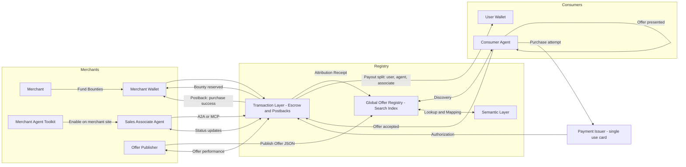
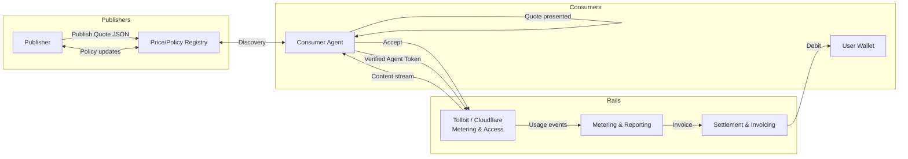

### Agentic Web: A Two‑Sided Protocol for Commerce Bounties and Content Paywalls

Version: 0.1 (draft)

Author: Jared (with AI co-author)

Date: 2025-08-13

---

### Abstract

This paper proposes an open, interoperable Agentic Web where autonomous agents transact with merchants and publishers under two mirrored economics:

- Commerce side: merchants compete for agent-driven transactions with bounties (CPA/CPL/CPO).
- Content side: publishers charge usage-based access via standardized metering and billing rails.

We specify identities, registries, message formats, receipts, attribution, and settlement protocols. We also outline a reference implementation for a Global Offer Registry (GOR) and a companion browser extension that demonstrates first-party consumer agent behavior while remaining open to third-party agents.

---

### 1. Motivation & Background

- Agentic browsers and LLM-powered workflows are shifting how users discover, evaluate, and buy.
- Publisher economics (paywalls, per-request pricing) differ from merchant economics (acquisition bounties). The Agentic Web needs first-class primitives for both.
- Today’s affiliate/performance ecosystem is brittle (cookies, last-click hijacks, opaque attribution). A signed, server-verified model is better aligned.
- Paywall/metering rails (e.g., Tollbit, Cloudflare’s pay-per-crawl/verified bots) and agentic checkout rails (e.g., Bold, Shopify agent APIs) are emerging now.

---

### 2. Design Principles

- Protocols over platforms; interchangeable roles and minimal trust assumptions.
- Verifiable agent identity, signed messages, explicit consent, and privacy by design.
- Cookieless attribution and server-to-server receipts rather than browser cookies.
- Transparency of economics: clear disclosure and optional user revenue share.
- Composability via A2A (agent-to-agent) envelopes and MCP capability discovery.

---

### 3. Agentic Commerce Ecosystem

Figure 1 models the high-level flow derived from the hand-drawn diagram.



#### 3.1 Roles

- Merchant: offers goods/services and funds bounties.
- Sales Associate Agent: agent maintained by merchant that receives buying intents and assists buyer.
- Merchant Agent Toolkit: software vendors will sell agent toolkits that merchants can add to their websites.
- Offer Publisher: publishes the merchant's offers (bounties/ads).
- Global Offer Registry (GOR): signed offer index and provenance registry.
- Semantic Layer: all the tooling and processes for finding products that meet a buyer's needs.
- Transaction Layer: all the tooling and processes for executing transactions between buyer and seller.
- Consumer Agent: the interface by which buyers express buying intent and authorize transactions. Examples: ChatGPT, the Comet browser
- Wallets: merchant wallet funds bounties; user wallet receives rev-share.
- Payment Issuer: issues single-use or scoped payment credentials.

#### 3.2 Protocols & Artifacts

- Offer Document (JSON) — durable, verifiable description of bounty terms and triggers.
- A2A Envelope — signed capability and policy declaration for agent-to-agent calls.
- Attribution Receipt — server-issued proof that ties an order to an agent and offer.
- Settlement Postback — authoritative merchant-side confirmation with amounts and splits.
- MCP Profile — capability discovery and invocation across heterogeneous agents.

#### 3.3 Example Schemas

Offer JSON (v0):

```json
{
  "offer_id": "ofr_123",
  "merchant": {
    "id": "mrc_001",
    "name": "Acme Running Co.",
    "domain": "shop.acme.run"
  },
  "terms": {
    "trigger": "checkout_complete",
    "bounty": {
      "currency": "USD",
      "amount": 12.50,
      "rev_share_split": { "user": 0.5, "agent": 0.4, "associate": 0.1 }
    },
    "eligibility": ["US", "CA"],
    "sku_scope": ["shoe_*"],
    "expiration": "2026-12-31T23:59:59Z"
  },
  "attribution": {
    "method": "server_postback",
    "postback_url": "https://merchant.example.com/postbacks",
    "required_fields": ["order_id", "agent_id", "signature", "timestamp"],
    "signature_alg": "ed25519"
  },
  "provenance": {
    "publisher": "assoc_789",
    "published_at": "2025-08-13T01:02:03Z",
    "signature": "base64-edsig..."
  }
}
```

Attribution Receipt (issued by Transaction Layer):

```json
{
  "receipt_id": "rcpt_456",
  "offer_id": "ofr_123",
  "order_id": "ord_90210",
  "agent_id": "agt_abc",
  "user_id": "usr_def",
  "timestamp": "2025-08-13T01:15:00Z",
  "bounty_reserved": { "currency": "USD", "amount": 12.50 },
  "signature": "base64-edsig..."
}
```

Settlement Postback (merchant → Transaction Layer):

```json
{
  "order_id": "ord_90210",
  "status": "success",
  "amount": { "currency": "USD", "total": 125.00 },
  "split": { "user": 6.25, "agent": 5.00, "associate": 1.25 },
  "timestamp": "2025-08-13T01:17:42Z",
  "signature": "base64-merchant-edsig"
}
```

#### 3.4 Flows

1) Offer lifecycle

- Publish → Index → Discover → Present → Accept.

2) Checkout and attribution

- Intent captured → agent identity verified → order created → attribution receipt issued → merchant postback confirms success → payouts split to wallets.

3) Disputes and refunds

- Reversal events sent via postback; Transaction Layer adjusts payouts and issues updated receipts.

#### 3.5 Reference Implementation (GOR)

- Search and provenance: signed feeds of Offer JSON with verifiable publisher identity.
- Semantic mapping: ontology to classify offers by product, merchant, geography, and trigger.
- Transaction service: escrow, receipts, settlement, revenue-share computation.
- First-party consumer agent: browser extension that surfaces offers, manages consent, and executes checkout via merchant-approved endpoints (e.g., Bold/Shopify agent APIs).

---

### 4. Agentic Content Ecosystem

The content side mirrors commerce but reverses economics: agents pay publishers for usage.



#### 4.1 Roles

- Publisher: provides content/services gated by usage-based pricing or policy.
- Price/Policy Registry: signed catalog of quotes and policies.
- Rails: access control, metering, reporting, and settlement providers.
- Consumer Agent: negotiates price, presents quotes, and consumes content.
- User Wallet: funds usage.

#### 4.2 Example Schemas

Quote JSON (v0):

```json
{
  "quote_id": "qt_001",
  "publisher": { "id": "pub_42", "name": "Example News" },
  "content_id": "art_12345",
  "price_model": { "type": "per_request", "unit_price": { "currency": "USD", "amount": 0.05 } },
  "policy": { "max_tokens": 20000, "cache_ttl": 3600 },
  "expiration": "2025-08-14T00:00:00Z",
  "signature": "base64-edsig..."
}
```

Usage Event:

```json
{
  "event_id": "evt_789",
  "quote_id": "qt_001",
  "agent_id": "agt_abc",
  "units": { "tokens": 7421 },
  "nonce": "n-123",
  "timestamp": "2025-08-13T02:00:00Z",
  "proof": "hash-of-request-response",
  "signature": "base64-edsig..."
}
```

---

### 5. Interop Between Commerce and Content

- Shared identity and consent: one agent identity and wallet configuration across both sides.
- Cross-ledger accounting: bounty income can offset content spend with clear receipts.
- Policy harmonization: agents disclose incentives to users; publishers disclose rates.
- Privacy: exchange signed receipts and minimal metadata instead of raw logs.

---

### 6. Standards Roadmap

- V0: Offer JSON, Quote JSON, Attribution Receipt, Usage Event; server-to-server postbacks; HTTP Message Signatures.
- V1: A2A envelope and MCP profile for capability discovery; portable agent identity.
- V2: Decentralized registry discovery (signed feeds), portable reputations, and multi-provider settlement.

---

### 7. Security, Compliance, and Trust

- Agent verification: signed requests, rotating keys, capabilities scoping, and replay protection.
- Fraud mitigation: escrowed bounties, anomaly detection on receipts/events, dispute flows.
- Consumer protection: clear disclosures (FTC/DSA), user-controlled rev-share, spend caps.
- Payments: single-use cards or scoped payment credentials; refund/chargeback handling.

---

### 8. Business Model & Ecosystem Strategy

- Open standards to catalyze a multi-sided market; capture value via the GOR, analytics, and premium tooling.
- First-party products: browser extension (consumer agent), registry/search, transaction service.
- Third-party enablement: SDKs for merchants and publishers; public APIs; certification program (“Agent-Friendly Merchant/Publisher”).

---

### 9. Reference Implementation Plan

1) Pilot vertical for commerce (Shopify/DTC categories with fast AOVs) and selected publishers for content.
2) Ship SDKs: simple Offer JSON publisher + postback handler; Quote JSON + usage events emitter.
3) Release first-party extension with consent UI, offer selection, and checkout via agentic endpoints.
4) Launch GOR private beta; iterate on schemas; publish conformance tests.

---

### 10. Appendices

#### Appendix A: A2A Envelope (draft)

```json
{
  "envelope_id": "a2a_001",
  "issuer": "agt_abc",
  "audience": "service://transaction-layer",
  "claims": {
    "capabilities": ["present_offer", "initiate_checkout", "accept_quote"],
    "policies": { "pii": "minimized", "spend_limit_usd": 100.0 }
  },
  "issued_at": "2025-08-13T00:10:00Z",
  "expires_at": "2025-08-20T00:10:00Z",
  "signature": "base64-edsig..."
}
```

#### Appendix B: Threat Model (high level)

- Commission hijacking → mitigate with signed receipts, server postbacks, and domain binding.
- Fake orders/refunds → require merchant-signed settlement and delayed payout windows.
- Replay attacks → nonces and short-lived tokens; double-spend detection.
- Privacy leakage → minimize payloads; separate identity from behavioral data; aggregate reporting.

#### Appendix C: Glossary

- GOR: Global Offer Registry, a signed, searchable index of Offer JSON.
- A2A: Agent-to-Agent envelope to communicate capabilities and policies.
- MCP: Model Context Protocol for capability discovery and interop across agents.
- Postback: server-to-server webhook to confirm events (e.g., purchase success).
- Receipt: signed document binding an event to an offer/quote and agent.

---

### 11. Figures

- Figure 1: Agentic Commerce Ecosystem (Mermaid) — see section 3.
- Figure 2: Agentic Content Ecosystem (Mermaid) — see section 4.

---

This is a living draft. Contributions welcome via issues and PRs. The goal is to standardize the primitives that let agents and websites transact fairly and safely across both sides of the web.


